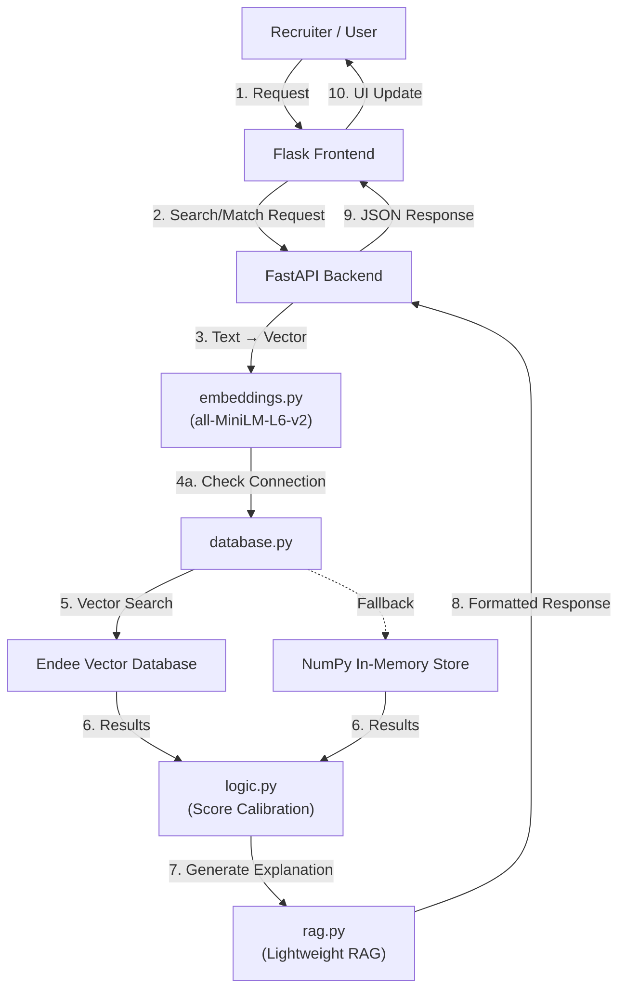

# 🧠 AI Resume Matching System (Endee Vector Database)

## 📌 Overview

Recruiters often spend hours manually reviewing resumes, which is inefficient and error-prone.

Traditional systems rely on **keyword matching**, which fails when different terms are used (e.g., *"ML" vs "Machine Learning"*).

👉 This project solves that problem using **semantic search**, where the system understands the *meaning* of text instead of just matching keywords.

---

## 🚀 Key Features

* 🔍 Semantic Resume Search (not keyword-based)
* ⚡ High-performance vector search using Endee
* 🧠 Sentence embeddings using `all-MiniLM-L6-v2`
* 📊 Match score with percentage calibration
* 🧾 AI-generated justification (RAG-based)
* 🔄 Fallback system (NumPy) if Endee is unavailable
* 🌐 Full-stack application (FastAPI + Flask)

---

## 🧱 Tech Stack

**Backend:**

* FastAPI
* Python
* Sentence Transformers
* NumPy

**Frontend:**

* Flask
* HTML, CSS

**Database:**

* Endee Vector Database (C++ based)

---

## 🧠 How It Works

1. Recruiter enters a job description
2. Text is converted into a **384-dimensional vector**
3. Endee stores and searches similar vectors
4. Matching resumes are retrieved
5. Scores are converted into percentages
6. System generates an explanation
7. Results are displayed in UI

---

## 🏗️ System Architecture



---

## 🏗️ Project Structure

```
endee/                         ← repo root
│
├── requirements.txt
├── .gitignore
├── README.md
│
└── project/
    │
    ├── backend/
    │   ├── __init__.py
    │   ├── app.py              # FastAPI backend
    │   ├── embeddings.py       # Text → vector conversion
    │   ├── database.py         # Endee + fallback logic
    │   ├── logic.py            # Score calibration
    │   ├── rag.py              # Explanation generation
    │   ├── loader.py           # Resume indexing
    │   └── requirements.txt    # Backend-specific deps
    │
    ├── frontend/
    │   ├── app.py              # Flask frontend
    │   └── templates/          # HTML UI
    │
    └── dataset/
        └── resumes/            # Input resumes (.txt/.pdf)
```

---

## 🧠 RAG (Retrieval-Augmented Generation)

This project implements a **lightweight RAG pipeline (without LLMs)**:

* **Retrieve** → Get top matching resume from Endee
* **Augment** → Extract relevant keywords from the job description
* **Generate** → Create human-readable explanation

💡 Example:

> Candidate matches 82% with strong skills in Python, FastAPI, and AWS.

---

## 📊 Score Calibration

| Raw Score | Match Percentage |
| --------- | ---------------- |
| 0.4+      | 90–100%          |
| 0.3–0.4   | 80–90%           |
| 0.2–0.3   | 60–80%           |
| < 0.2     | < 60%            |

---

## 🛡️ Production Readiness

* ✅ Environment variables (`.env`) used — no hardcoded secrets
* ✅ Clean package structure (`__init__.py` in all packages)
* ✅ `.gitignore` configured properly (`__pycache__`, `venv/`, `.env`)
* ✅ Fallback mechanism implemented (NumPy cosine similarity)
* ✅ Modular and scalable code

---

## ⚙️ Installation & Setup

### 1️⃣ Clone the Repository

```bash
git clone https://github.com/GTejaNaidu/endee.git
cd endee
```

### 2️⃣ Install Dependencies

```bash
pip install -r requirements.txt
```

### 3️⃣ Configure Environment (Optional)

Create a `.env` file at the repo root:

```
NDD_URL=http://localhost:8080/api/v1
NDD_AUTH_TOKEN=
BACKEND_URL=http://localhost:8000
FLASK_DEBUG=false
```

> If Endee is not running, the system automatically switches to an in-memory NumPy fallback — no extra setup needed.

### 4️⃣ Run Backend (FastAPI)

```bash
uvicorn project.backend.app:app --host 127.0.0.1 --port 8000 --reload
```

### 5️⃣ Run Frontend (Flask)

```bash
python project/frontend/app.py
```

### 6️⃣ Open in Browser

```
http://127.0.0.1:5000
```

---

## 📡 API Endpoints

| Endpoint         | Method | Description                        |
| ---------------- | ------ | ---------------------------------- |
| `/search`        | POST   | Semantic search across all resumes |
| `/upload-resume` | POST   | Upload and index a new resume      |
| `/match`         | POST   | Match a JD against a single resume |

---

## 📁 Dataset

Place resumes inside:

```
project/dataset/resumes/
```

Supported formats: `.txt`, `.pdf`

> A `sample_resume.txt` is included for demo purposes. Add your own resumes — they are indexed automatically on backend startup.

---

## 🎯 What This Project Demonstrates

* Vector databases (Endee integration via REST API)
* Semantic AI using sentence embeddings
* RAG architecture (without an external LLM)
* REST API development (FastAPI — 3 endpoints)
* Full-stack integration (Flask frontend + FastAPI backend)
* Production-level coding practices

---

## 🧠 Why Endee?

Endee is a high-performance **C++ vector database** optimized for extreme speed and accuracy in similarity search. This project leverages it to solve the fundamental problem of semantic resume matching.

-   ⚡ **Optimized Search:** Built for cosine similarity operations at the hardware level.
-   🎯 **Clean Integration:** Accessible through a standard REST API, making it lightweight for production systems.
-   📐 **Scale:** Capable of handling millions of vectorized documents with consistent latency.

---

## 📌 Future Improvements

* Add LLM-based explanation (GPT / Gemini)
* Deploy using Docker & Cloud
* Add authentication for recruiters
* Improve UI/UX with React

---

## ⭐ Acknowledgment

This project was built as part of an AI/ML assignment using the **Endee Vector Database** to demonstrate semantic search and real-world AI application.

---
